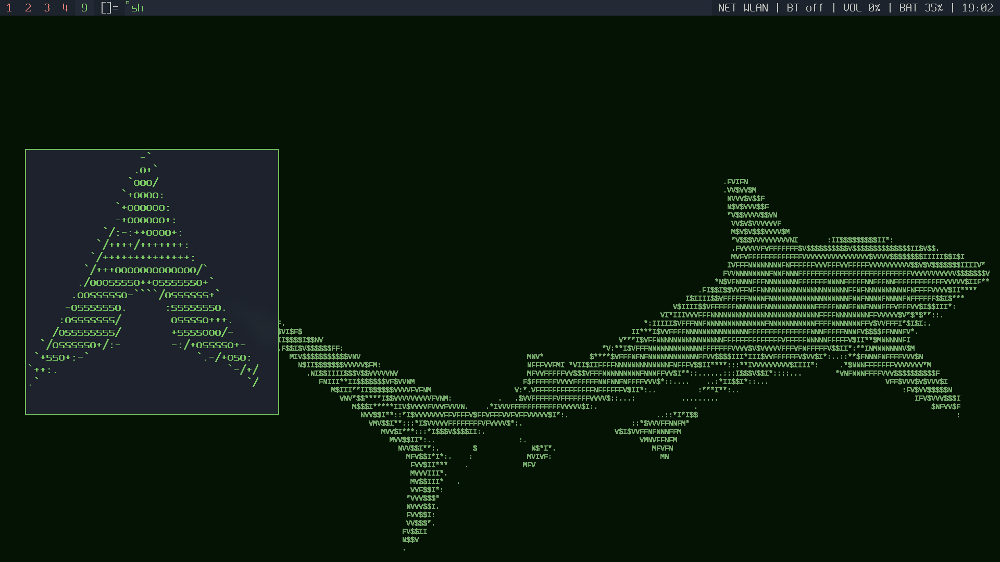

# my suckless setup

my personal dwm build + dotfiles.



## stack

**dwm** · **dmenu** · **slock** · **dwmblocks** · kitty · yazi · picom · dunst · mpd/ncmpcpp · mpv/ytfzf · greetd

## keybinds `Mod = Super`

| key | does |
|-----|------|
| `Mod+Enter` | terminal |
| `Mod+D` | launcher |
| `Mod+B` | browser |
| `Mod+F` | file manager |
| `Mod+M` | music player |
| `Mod+Y` | youtube search → mpv |
| `Mod+W` | wallpaper picker |
| `Mod+X` | lock screen |
| `Mod+Space` | toggle layout |
| `Mod+Shift+E` | exit menu |
| `Mod+Shift+S` | area screenshot (blur) |
| `Print` | fullscreen screenshot |
| media keys | volume / brightness / playback |

## status bar

clickable blocks: music (MPD + MPRIS) · network · bluetooth · volume · battery · clock

## scripts

| script | what it does |
|--------|-------------|
| `wall` | pick wallpaper from `~/Pictures/Wallpapers/` |
| `screenshot` | full / area / menu, saves to `~/Pictures/Screenshots/` |
| `volume` | volume up/down/mute + signals the bar |
| `brightness` | screen brightness via brightnessctl |
| `music-control` | play/pause/next/prev, works with MPD and MPRIS (youtube etc.) |
| `now-playing` | current track from MPD or playerctl |
| `bluetooth-menu` | dmenu bluetooth picker |
| `bt-console` | bluetui TUI for bluetooth |
| `exit-menu` | lock / suspend / hibernate / logout / reboot / shutdown |
| `file-manager` | opens yazi |
| `browser` | opens `$BROWSER` or the first browser it finds |
| `yt` | search youtube in a terminal, plays in mpv (no browser) |
| `fzf-cd` | fuzzy jump to any directory in a new window |
| `nightlight` | shifts color temperature at night automatically |
| `kb-watch` | dunst notification when you switch keyboard layout |
| `fetch` | fastfetch system info |
| `term-calendar` | floating terminal calendar |
| `dmenu-theme` | themed dmenu wrapper used by everything |
| `dmenupass` | sudo password prompt via dmenu |

## install

works on Arch (uses `yay` for two AUR packages) or Debian (apt). the installer detects which you're on.

```sh
git clone <repo>
cd my-suckless-setup
./install.sh
```

builds dwm/dmenu/slock/dwmblocks from source, copies all configs and scripts, sets up greetd.

## uninstaller

theres no uninstaller because i dont plan on uninstalling.
